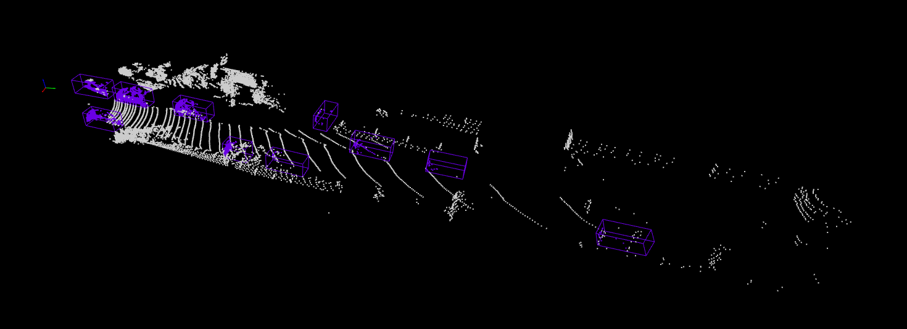

# 3D Object Detection using MMDetection3D


## 1. Introduction

In this repository, we will use the mmdetection3d to perform 3D object detection.

## 2. Installation

To use this repository, we need to set up our environment with its required libraries. The steps are:

1. Create new python virtual environment
    ```
    # Create a new virtual env named 3d_env
    python -m 
    
    # Go inside the virtual environment
    source 3d_env/bin/activate
    ```

2. Install required packages

   ```
   # Change pip version
   python -m pip install pip==24.*
   
   # Install pytorch and torchvision
   pip install torch==2.0.1 torchvision==0.15.2 

   ## Install mmengine, mmcv, and mmdet
   pip install -U openmim
   mim install mmengine
   mim install 'mmcv>=2.0.0rc4'
   mim install 'mmdet>=3.0.0'
   ```

3. Install the mmdetection3d library

   ```
   git clone https://github.com/open-mmlab/mmdetection3d.git -b dev-1.x
   # "-b dev-1.x" means checkout to the `dev-1.x` branch.
   cd mmdetection3d
   pip install -v -e .
   # "-v" means verbose, or more output
   # "-e" means installing a project in edtiable mode,
   # thus any local modifications made to the code will take effect without reinstallation.
   ```

## 3. Usage

1. Download test dataset

```
    mim download mmdet3d --config pointpillars_hv_secfpn_8xb6-160e_kitti-3d-car --dest .
```

2. Visualize dataset

```
    python demo/pcd_demo.py demo/data/kitti/000008.bin pointpillars_hv_secfpn_8xb6-160e_kitti-3d-car.py hv_pointpillars_secfpn_6x8_160e_kitti-3d-car_20220331_134606-d42d15ed.pth --show

```

The command will open a pop-up window displaying the visualization of 3D object detection of point clouds as shown in figure below.

<p align="center">
  
</p>


## References